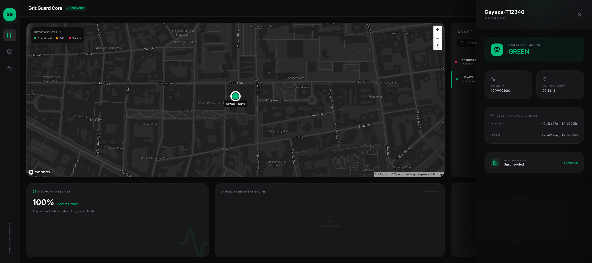
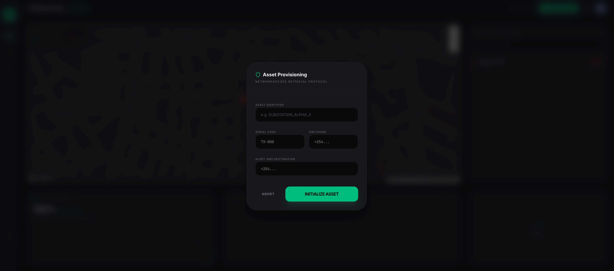
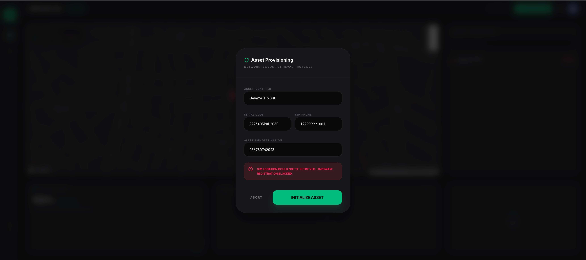
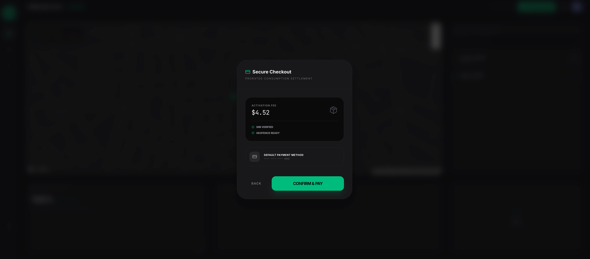
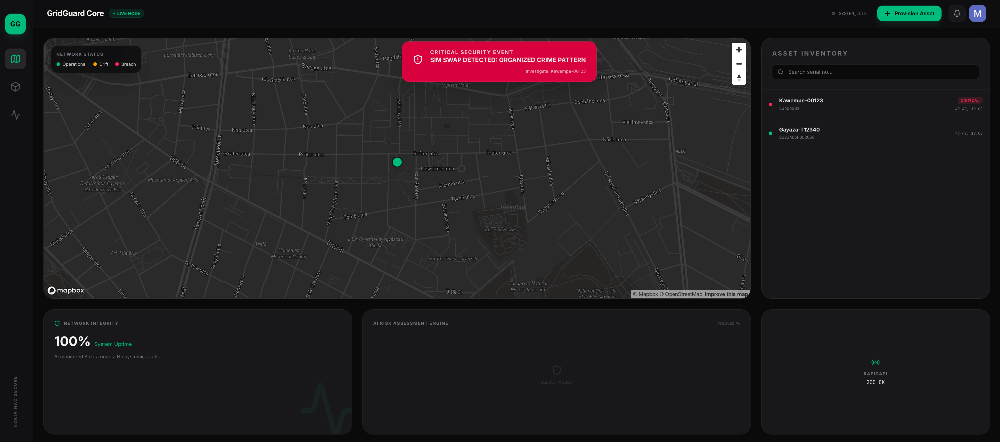
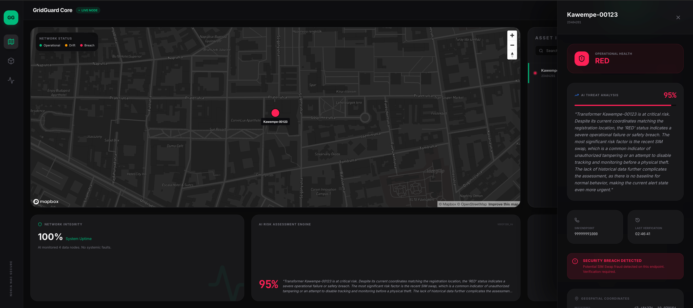
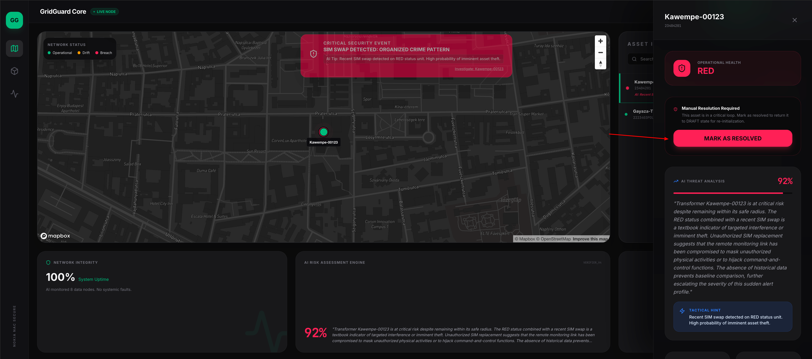
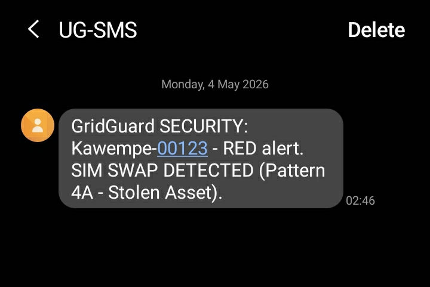

# GridGuard

GridGuard is a production-ready, real-time electrical transformer monitoring and management system. It provides utilities and infrastructure managers with a unified dashboard to monitor asset health, prevent SIM-based fraud, and leverage AI for predictive risk assessment.

## 🔴 System Summary & Process Flow

GridGuard Core is a high-integrity asset monitoring ecosystem designed to secure critical infrastructure, specifically electrical transformers, against physical and digital threats through a multi-layered verification process. The application flow begins with **Secure Asset Provisioning**, where a technician registers a device using its serial code and SIM endpoint, triggering a real-time 'Location Verification' protocol that matches network Cell-IDs against onboard GPS coordinates to ensure the hardware is exactly where it claims to be. This is followed by a **Secure Checkout** phase, where prorated consumption models are settled before the node goes 'LIVE'. Once active, the system enters a **'Continuous Monitoring'** state, utilizing Nokia Networkascode APIs to detect SIM-swap events—a key indicator of tampering; if a SIM swap is detected, the asset is immediately flagged as RED, a **Critical Security Event** notification is broadcast, and an automated SMS alert is dispatched to designated security personnel. This raw data is then ingested by an **AI Risk Assessment Engine** powered by Google Gemini, which generates nuanced threat analysis reports, distinguishing between operational drift and organized crime patterns, and locking the asset into a 'Manual Resolution' state until a verified supervisor resolves the breach, effectively closing the loop between real-time network signals and actionable security intelligence.

## 📸 Project Gallery

### 1. Operations Dashboard
The primary command center showing real-time asset health across the grid.


### 2. Secure Provisioning & Verification
Network-as-Code retrieval protocol ensures hardware integrity before activation.
<p align="center">
  
  
</p>

### 3. Monetization & Checkout
Automated prorated billing for device activation.


### 4. Critical Security Event (SIM Swap)
Immediate detection of unauthorized tampering with automated broadcast alerts.


### 5. AI Threat Analysis
Gemini-powered risk assessment providing tactical insights into security breaches.


### 6. Incident Resolution
The "Manual Resolution" loop ensures that critical faults are physically inspected before clearing.


### 7. Real-time Security SMS
Out-of-band notification protocol for immediate site-manager awareness.


## 🚀 Key Features

- **Real-time Monitoring**: Centralized Mapbox dashboard for tracking transformer geolocation and status.
- **Nokia Networkascode Integration**:
  - **SIM Swap Detection**: Prevents equipment theft and unauthorized SIM usage by monitoring SIM swap events.
  - **Location Verification**: Complements GPS data with network-based cell-id tracking.
- **AI Risk Rating**: Leverages **Google Gemini AI** to analyze asset history, SIM events, and maintenance logs into actionable risk scores (GREEN, ORANGE, RED).
- **Comprehensive Maintenance Logs**: Automated alerts and manual maintenance scheduling.
- **Multi-tenant SaaS Infrastructure**: 
  - Strict data isolation for different entities.
  - Full-screen integrated billing and subscription management.
  - Support for "Pay-per-Device" and "Enterprise" tiers.

## 🛠️ Tech Stack

- **Framework**: [React 19](https://react.dev/) + [Vite](https://vitejs.dev/)
- **Styling**: [Tailwind CSS 4](https://tailwindcss.com/)
- **Animations**: [Motion](https://motion.dev/)
- **Database & Auth**: [Firebase](https://firebase.google.com/) (Firestore & Authentication)
- **Maps**: [Mapbox GL JS](https://www.mapbox.com/)
- **AI Engine**: [Google Gemini AI SDK (@google/genai)](https://ai.google.dev/)
- **Network API**: [Nokia Networkascode](https://networkascode.nokia.com/)
- **Icons**: [Lucide React](https://lucide.dev/)

## 📋 Project Structure

```text
├── src/
│   ├── components/       # Reusable UI parts & Layouts
│   ├── services/         # Firebase, Gemini, and Nokia API logic
│   ├── types/            # TypeScript interfaces
│   ├── pages/            # Main application views (Dashboard, Asset Management, Billing)
│   └── App.tsx           # Router and state management
├── server.ts             # Express server (Full-stack entry point)
├── firebase-blueprint.json # Data model definition
├── firestore.rules       # Hardened security rules with tenant isolation
└── metadata.json         # Project identity and capabilities
```

## ⚙️ Setup & Installation

### Prerequisites

- Node.js (Latest LTS)
- NPM or PNPM
- A Firebase Project
- Mapbox Access Token
- Gemini API Key

### Installation

1. **Clone the repository**:
   ```bash
   git clone <repository-url>
   cd gridguard
   ```

2. **Install dependencies**:
   ```bash
   npm install
   ```

3. **Environment Configuration**:
   Create a `.env` file in the root (refer to `.env.example`):
   ```env
   # Application Keys
   VITE_MAPBOX_ACCESS_TOKEN=your_mapbox_token
   GEMINI_API_KEY=your_gemini_api_key

   # Billing Rates
   VITE_PLAN_MONTHLY_DEVICE_AMOUNT=30
   VITE_PLAN_ENTERPRISE_ANNUAL_AMOUNT=12000
   VITE_PLAN_ENTERPRISE_MONTHLY_EQUIVALENT=1000
   ```

4. **Firebase Configuration**:
   Place your `firebase-applet-config.json` in the root directory. Ensure Firestore and Auth are enabled in your console.

5. **Deploy Security Rules**:
   Ensure `firestore.rules` are deployed to your Firebase project to enforce data isolation.

### Running the App

```bash
# Development Mode
npm run dev

# Build for Production
npm run build
```

## 🔐 Data Security & Isolation

GridGuard uses a **Zero-Trust** security model for its data. Every document in the `/transformers`, `/alerts`, and `/billing` collections is protected by ABAC (Attribute-Based Access Control) rules. 

- Users can only view or modify assets they own (`ownerId == request.auth.uid`).
- Billing data is strictly private to the authenticated user.
- AI-generated fields are protected from direct client modification where necessary.

## 📄 License

This project is licensed under the MIT License - see the LICENSE file for details.
