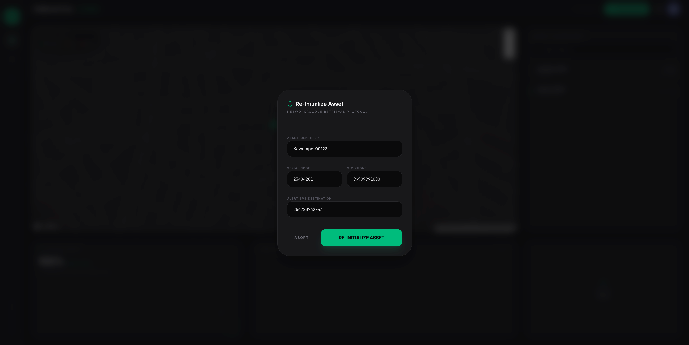

# GridGuard: CAMARA APIs Meet Infrastructure Protection

**GridGuard is the first system to repurpose telecom network APIs for counter-terrorism and critical infrastructure protection.** It prevents the organized theft and vandalism of electrical transformers across Sub-Saharan Africa by combining low-cost GPS trackers ($15) with CAMARA APIs—transforming mobile towers into autonomous watchdogs for power grids.

## 🚨 The Crisis: Infrastructure Terrorism in Sub-Saharan Africa

In 2025, Uganda faced a stark revelation. Seventeen suspects were arraigned before the Nakawa Chief Magistrates Court, not for petty theft, but for _terrorism_. Their alleged crime: systematically vandalizing the nation's electricity grid. From Kampala to Luweero, Nakasongola to Mubende, they targeted transformers, high-voltage lines, and transmission poles, plunging key military and industrial installations—including the Nakasongola Military Hospital—into darkness. Their objective, prosecutors argued, was to spread fear, frustrate the government, and provoke economic chaos.

This was not an isolated incident. The Uganda Electricity Distribution Company Limited (UEDCL) reported a surge in attacks, with vandals armed with power saws cutting down poles and stealing cables worth millions of shillings—undetected. The response was swift and severe. President Yoweri Museveni directed the Chief of Defence Forces to establish an inter-agency security committee, controversially hinting at a "shoot-to-kill" policy.

**This crisis is not unique to Uganda.** Across Sub-Saharan Africa, the theft and vandalism of electrical transformers have escalated from petty crime to organized sabotage. Each incident costs utilities $10,000–$50,000 in replacements, leaves thousands without power for weeks, and diverts funds from electrification to repair. Yet current solutions—CCTV, security guards, expensive smart sensors—have consistently failed.

## 💡 The Overlooked Asset: Mobile Towers as Infrastructure Guardians

But there is an overlooked asset already present at every transformer: **the mobile phone tower.**

Telecom towers are often co-located with electrical infrastructure, sharing land, security, and backup power. These towers possess powerful network intelligence through **CAMARA APIs**—capabilities like SIM Swap detection, Device Status verification, Location Validation, Number Verification, and QoS on Demand. These APIs were originally designed for banking fraud prevention. **GridGuard repurposes them for an entirely novel application: physical asset protection against infrastructure terrorism.**

By combining low-cost GPS tags ($15) with the Nokia Network-as-Code platform, GridGuard transforms every mobile tower into an autonomous watchdog. When theft or vandalism occurs, the system detects it within **120 seconds**, verifies the event using three independent API signals, alerts responders with identity verification, and boosts their network priority—all autonomously.

## 🎯 GridGuard Objectives

GridGuard aims to prevent organized theft and vandalism of electrical transformers across Sub-Saharan Africa by repurposing CAMARA APIs as a low-cost, real-time asset protection system:

- **Detect** transformer theft or vandalism within 120 seconds of occurrence
- **Verify** incidents using three independent API signals (false positives < 5%)
- **Alert** utility security and police responders automatically via SMS within 5 seconds
- **Authenticate** responder identity before sharing sensitive location data
- **Boost** network priority for responders using QoS on Demand
- **Protect** each transformer for under $60 per year (vs. $10,000–$50,000 replacement cost)
- **Reduce** economic losses from grid sabotage by 60% in pilot areas

## 🔴 System Summary & Process Flow

GridGuard Core is a high-integrity asset monitoring ecosystem designed to secure critical infrastructure against organized sabotage through a multi-layered, API-driven verification process.

**Phase 1: Secure Asset Provisioning** — A technician registers a transformer by attaching a tamper-resistant GPS kit ($30: Quectel L96 tracker, IoT SIM, industrial epoxy casing, 14-day battery). The registration triggers a real-time **Location Verification** via CAMARA APIs to confirm the tag sits at registered coordinates.

**Phase 2: Secure Checkout** — Before the asset goes 'LIVE', prorated consumption models are settled through the SaaS billing interface.

**Phase 3: Continuous Monitoring** — The system continuously orchestrates five CAMARA API calls: **Device Status** checks every 15 minutes if the GPS tag remains reachable; **Location Verification** confirms coordinates haven't drifted beyond 50 meters; **SIM Swap** detection runs every 6 hours (or on anomaly) to catch illegal SIM relocation; **Risk Scoring** uses Google Gemini to evaluate transformer vulnerability based on time, weather, attack patterns, and road activity; and **Response Automation** runs on confirmed theft (HIGH confidence > 80%).

**Phase 4: Threat Detection & Response** — When **any two of the first three APIs return an anomaly simultaneously**, a high-confidence alert triggers. The AI Decision Engine converts API anomalies into confidence scores (LOW < 50%, MEDIUM 50–80%, HIGH > 80%). HIGH alerts activate immediate drone dispatch and SMS alerts to all responders. **Number Verification** challenges responders to authenticate before receiving exact GPS coordinates, preventing false callouts. **QoS on Demand** boosts network priority for all responder phone numbers within 10 seconds. Total response time: under 90 seconds from detection to full dispatch.

## 🏗️ Implementation: Four-Layer Architecture

### Hardware Layer

Every protected transformer receives a tamper-resistant kit (~$30):

- **Quectel L96 GPS Tracker**: Reports location every 15 minutes
- **IoT SIM Card**: Connects to 2G/4G networks (85%+ coverage across Sub-Saharan Africa)
- **Industrial Epoxy Casing**: Permanently seals tracker inside transformer body
- **Rechargeable Battery**: 14-day runtime

_Thieves cannot remove the tracker without destroying the transformer, which defeats their purpose of reselling it intact._

### API Orchestration Layer (CAMARA)

GridGuard makes five calls to CAMARA APIs via Nokia Network-as-Code:

1. **Device Status**: Checks if GPS tag is reachable (every 15 min)
2. **Location Verification**: Confirms tag at registered coordinates (every 15 min)
3. **SIM Swap Detection**: Detects illegal SIM relocation (every 6 hours + on anomaly)
4. **Number Verification**: Authenticates responder identity before sharing sensitive data
5. **QoS on Demand**: Boosts network priority for responders during pursuit

_A theft is confirmed when any two of the first three APIs return an anomaly simultaneously._

### AI Decision Engine Layer

A lightweight agentic AI layer performs three functions:

1. **Risk Scoring**: Rates each transformer nightly (0–100) based on time of day, weather, attack patterns, road activity
2. **Confidence Conversion**: Converts API anomalies into confidence scores (LOW / MEDIUM / HIGH)
3. **Response Routing**: Automatically chooses actions based on confidence:
   - **HIGH (> 80%)**: Immediate drone dispatch + SMS to all responders
   - **MEDIUM (50–80%)**: SMS to supervisor for manual verification
   - **LOW (< 50%)**: Log anomaly + increase check frequency to 5 minutes

### Response Automation Layer

Once theft is confirmed at HIGH confidence, GridGuard executes autonomously:

- SMS alerts to utility security manager + local police (5 seconds)
- QoS on Demand activation for all responders (10 seconds)
- Number Verification challenge sent to each responder (they authenticate before receiving GPS)
- Optional drone dispatch to last known GPS location (Zipline integration in production)
- Optional community broadcast to local WhatsApp group

_Total time: theft detection → full response dispatch = under 90 seconds_

## 📸 Project Gallery

### 1. Operations Dashboard

The primary command center showing real-time asset health across the grid.


### 2. Secure Provisioning & Verification

Network-as-Code retrieval protocol ensures hardware integrity before activation.

<p align="center">
   
   
</p>

### 3. Onboarding Prorated Payment

Prorated payment capture during onboarding before activation.


### 4. Asset Re-initialization

Manual re-initialization flow for previously flagged assets.


### 5. Critical Security Event (SIM Swap)

Immediate detection of unauthorized tampering with automated broadcast alerts.


### 6. AI Threat Analysis

Gemini-powered risk assessment providing tactical insights into security breaches.


### 7. Incident Resolution

The "Manual Resolution" loop ensures that critical faults are physically inspected before clearing.


### 8. Real-time Security SMS

Out-of-band notification protocol for immediate site-manager awareness.


## 🚀 Key Features

- **CAMARA API Orchestration**: Five-API coordination (Device Status, Location Verification, SIM Swap, Number Verification, QoS on Demand) for sub-120-second threat detection
- **Real-time Monitoring**: Centralized Mapbox dashboard for tracking transformer geolocation, status, and risk scores
- **AI-Driven Risk Scoring**: Google Gemini + DeepSeek analyze time-of-day, weather, historical attack patterns, and road activity for automated threat assessment
- **Autonomous Response**: High-confidence threats trigger drone dispatch, SMS alerts, responder authentication, and network priority boosting in under 90 seconds
- **Multi-signal Verification**: Reduces false positives to < 5% by requiring agreement across multiple independent CAMARA APIs
- **Responder Identity Authentication**: Number Verification ensures only authorized personnel receive sensitive location data
- **Network Priority Boosting**: QoS on Demand guarantees responders maintain connectivity during pursuit
- **Comprehensive Maintenance Logs**: Automated alerts and manual scheduling for preventive maintenance
- **Multi-tenant SaaS Infrastructure**:
  - Strict data isolation per utility/entity
  - Full-screen integrated billing and subscription management
  - Support for "Pay-per-Device" and "Enterprise" tiers
  - Cost: < $60 per transformer per year vs. $10,000–$50,000 replacement cost

## 🛠️ Tech Stack

**Frontend**

- **Framework**: [React 19](https://react.dev/) + [Vite](https://vitejs.dev/)
- **Styling**: [Tailwind CSS 4](https://tailwindcss.com/)
- **Animations**: [Motion](https://motion.dev/)
- **Maps**: [Mapbox GL JS](https://www.mapbox.com/)
- **Icons**: [Lucide React](https://lucide.dev/)

**Backend & APIs**

- **API Orchestration**: [NestJS](https://nestjs.com/) (robust, asynchronous orchestration)
- **CAMARA APIs**: [Nokia Network-as-Code](https://networkascode.nokia.com/) platform (Device Status, Location Verification, SIM Swap, Number Verification, QoS on Demand)
- **AI Decision Engine**: [Google Gemini AI SDK](https://ai.google.dev/) (risk scoring) + [DeepSeek](https://www.deepseek.com/) (autonomous orchestration & decision-making)

**Database & Infrastructure**

- **Database & Auth**: [Firebase](https://firebase.google.com/) (Firestore & Authentication)
- **SMS Delivery**: [Africa's Talking](https://africastalking.com/) or [Twilio](https://www.twilio.com/)
- **Deployment**: Docker + Kubernetes (Azure or DigitalOcean)
- **IoT Simulation** (Prototype): ESP32 with GPS modules

**Live Integrations** (Production-Ready)

- **Drone Dispatch**: [Zipline](https://www.flyzipline.com/) integration for autonomous response
- **Network Priority**: QoS on Demand via Nokia Network-as-Code

## 📋 Project Structure

```text
├── src/
│   ├── components/       # Reusable UI parts & Layouts
│   ├── services/         # Firebase, Gemini, and Nokia API logic
│   ├── types/            # TypeScript interfaces
│   ├── pages/            # Main application views (Dashboard, Asset Management, Billing)
│   └── App.tsx           # Router and state management
├── server.ts             # Express server (Full-stack entry point)
├── firebase-blueprint.json # Data model definition
├── firestore.rules       # Hardened security rules with tenant isolation
└── metadata.json         # Project identity and capabilities
```

## ⚙️ Setup & Installation

### Prerequisites

- Node.js (Latest LTS)
- NPM or PNPM
- A Firebase Project
- Mapbox Access Token
- Gemini API Key

### Installation

1. **Clone the repository**:

   ```bash
   git clone <repository-url>
   cd gridguard
   ```

2. **Install dependencies**:

   ```bash
   npm install
   ```

3. **Environment Configuration**:
   Create a `.env` file in the root (refer to `.env.example`):

   ```env
   # Application Keys
   VITE_MAPBOX_ACCESS_TOKEN=your_mapbox_token
   GEMINI_API_KEY=your_gemini_api_key

   # Billing Rates
   VITE_PLAN_MONTHLY_DEVICE_AMOUNT=30
   VITE_PLAN_ENTERPRISE_ANNUAL_AMOUNT=12000
   VITE_PLAN_ENTERPRISE_MONTHLY_EQUIVALENT=1000
   ```

4. **Firebase Configuration**:
   Place your `firebase-applet-config.json` in the root directory. Ensure Firestore and Auth are enabled in your console.

5. **Deploy Security Rules**:
   Ensure `firestore.rules` are deployed to your Firebase project to enforce data isolation.

### Running the App

```bash
# Development Mode
npm run dev

# Build for Production
npm run build
```

## 🔐 Data Security & Isolation

GridGuard uses a **Zero-Trust** security model for its data. Every document in the `/transformers`, `/alerts`, and `/billing` collections is protected by ABAC (Attribute-Based Access Control) rules.

- Users can only view or modify assets they own (`ownerId == request.auth.uid`).
- Billing data is strictly private to the authenticated user.
- AI-generated fields are protected from direct client modification where necessary.

## 📄 License

This project is licensed under the MIT License - see the LICENSE file for details.
